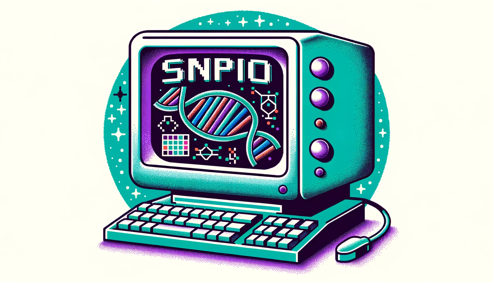

# Getting Started



This guide provides an overview of how to get started with the SNPio library. It covers the basic steps to read, manipulate, and analyze genotype data using the `VCFReader`, `PhylipReader`, `StructureReader`, `NRemover2`, and `PopGenStatistics` classes. SNPio is designed to simplify the process of handling genotype data and preparing it for downstream analysis, such as population genetics, phylogenetics, and machine learning. The library supports various file formats, including VCF, PHYLIP, and STRUCTURE, and provides tools for filtering, encoding, visualizing, and analyzing genotype data.

**NOTE:** This README file gives basic example usage for SNPio. However, for a full usage tutorial, please refer to the official [ReadTheDocs Documentation](https://snpio.readthedocs.io/en/stable/)

## Installation

Before using SNPio, ensure it is installed in your Python environment. You can install it using pip. In the project root directory (the directory containing `pyproject.toml`), type the command below in your terminal.

We recommend using a virtual environment to manage your Python packages. If you do not have a virtual environment set up, you can create one using the following commands:

```shell
python3 -m venv snpio_env
source snpio_env/bin/activate
pip install snpio
```

This will create a virtual environment named `snpio_env` and activate it. You can then install SNPio in this virtual environment using pip.

**Note:**
    - SNPio does not support Windows operating systems at the moment. We recommend using a Unix-based operating system such as Linux or macOS. If you have Windows, you can use the Windows Subsystem for Linux (WSL) to run SNPio.
    - We aim to support Anaconda environments in the future. For now, we recommend using a virtual environment with `pip` to install SNPio.

## Importing SNPio

To start using SNPio, import the necessary modules:

```python
from snpio import NRemover2, VCFReader, PhylipReader, StructureReader, Plotting, GenotypeEncoder, PopGenStatistics, TreeParser
```

### Example Usage

```python
vcf = "snpio/example_data/vcf_files/phylogen_subset14K_sorted.vcf.gz"
popmap = "snpio/example_data/popmaps/phylogen_nomx.popmap"

gd = VCFReader(
    filename=vcf, popmapfile=popmap, force_popmap=True, verbose=True,
    plot_format="png", plot_fontsize=20, plot_dpi=300, despine=True, prefix="snpio_example"
)
```

You can also include or exclude any populations from the analysis by using the `include_pops` and `exclude_pops` parameters:

```python
gd = VCFReader(
    filename=vcf, popmapfile=popmap, force_popmap=True, verbose=True,
    plot_format="png", plot_fontsize=20, plot_dpi=300, despine=True, prefix="snpio_example",
    include_pops=["ON", "DS", "EA", "GU"], exclude_pops=["MX", "YU", "CH"]
)
```

## Important Notes

- The `VCFReader`, `PhylipReader`, `StructureReader`, `NRemover2`, `PopGenStatistics`, and `GenotypeEncoder` classes treat the following characters as missing data:
  - "N"
  - "."
  - "?"
  - "-"
- `VCFReader` can read both uncompressed and compressed VCF files (gzipped). If your input file is in PHYLIP or STRUCTURE format, it will be forced to be biallelic.

## The Population Map File

To use `VCFReader`, `PhylipReader`, or `StructureReader`, you can optionally use a population map (popmap) file. This is a simple two-column, whitespace-delimited or comma-delimited file with SampleIDs in the first column and the corresponding PopulationIDs in the second column.

Example:

```none
Sample1,Population1
Sample2,Population1
Sample3,Population2
Sample4,Population2
```

Or, with a header:

```none
SampleID,PopulationID
Sample1,Population1
Sample2,Population1
Sample3,Population2
Sample4,Population2
```

### Providing a Popmap File

```python
gd = VCFReader(
    filename=vcf, popmapfile=popmap, force_popmap=True, verbose=True,
    plot_format="png", plot_fontsize=20, plot_dpi=300, despine=True, prefix="snpio_example"
)
```

## Reading Genotype Data

SNPio provides readers for different file formats:

### VCFReader

```python
gd = VCFReader(filename=vcf, popmapfile=popmap, force_popmap=True, verbose=True)
```

### PhylipReader

```python
phylip = "snpio/example_data/phylip_files/phylogen_subset14K.phy"
gd = PhylipReader(filename=phylip, popmapfile=popmap, force_popmap=True, verbose=True)
```

### StructureReader

```python
structure = "snpio/example_data/structure_files/phylogen_subset14K.str"
gd = StructureReader(filename=structure, popmapfile=popmap, force_popmap=True, verbose=True)
```

## Filtering Genotype Data with NRemover2

NRemover2 provides various filtering methods:

```python
nrm = NRemover2(gd)
gd_filt = nrm.filter_missing_sample(0.75)
             .filter_missing(0.75)
             .filter_missing_pop(0.75)
             .filter_mac(2)
             .resolve()

gd_filt.write_vcf("filtered_output.vcf")
```

Make sure to call the `resolve()` method at the end.

You can also perform a threshold search across multiple thresholds as follows:

```python
  # Initialize NRemover2 with GenotypeData object
  nrm = NRemover2(gd)

  # Specify filtering thresholds and order of filters
  nrm.search_thresholds(thresholds=[0.25, 0.5, 0.75, 1.0], maf_thresholds=[0.01, 0.05], mac_thresholds=[2, 5], filter_order=["filter_missing_sample", "filter_missing", "filter_missing_pop", "filter_mac", "filter_monomorphic", "filter_singletons", "filter_biallelic"])
```

The ``search_thresholds()`` method will search across thresholds for missing data, MAF, and MAC filters based on the specified thresholds and filter order. It will plot the results so you can visualize the impact of different thresholds on the dataset.

### Sankey Diagram

You can also make a neat Sankey Diagram depicting the loci filtered and retained at each filtering step:

```python
nrm = NRemover2(gd)

gd_filt = nrm.filter_missing_sample(0.75)
             .filter_missing(0.75)
             .filter_missing_pop(0.75)
             .filter_mac(2)
             .resolve()

nrm.plot_sankey_filtering_report()
```

## Genotype Encoding with GenotypeEncoder

```python
encoder = GenotypeEncoder(gd)

gt_ohe = encoder.genotypes_onehot
gt_int = encoder.genotypes_int
gt_012 = encoder.genotypes_012
```

## Population Genetics Analysis with PopGenStatistics

The `PopGenStatistics` class supports analyses such as D-statistics, Fst outliers, heterozygosity, nucleotide diversity, and AMOVA.

To use `PopGenStatistics`, you need to initialize it with genotype data and then call the desired analysis methods. For example:

```python
popgen = PopGenStatistics(gd)
d_stats = popgen.calculate_d_statistics()
fst_outliers = popgen.detect_fst_outliers()
amova_results = popgen.amova()
summary_stats = popgen.summary_statistics()

```

There are other available methods in PopGenStatistics. See the ReadTheDocs documentation for more info and examples.

## Loading and Parsing Phylogenetic Trees

```python
tp = TreeParser(genotype_data=gd, treefile="snpio/example_data/trees/test.tre")
tree = tp.read_tree()
tree.draw()
```

There are many more methods in the TreeParser module. See the ReadTheDocs documentation for more info.

## Benchmarking the Performance

```python
from snpio.utils.benchmarking import Benchmark
Benchmark.plot_performance(nrm.genotype_data, nrm.genotype_data.resource_data)
```

## Conclusion

This guide provides an overview of how to get started with the SNPio library. For more information, please refer to the API documentation and examples provided in the repository. If you have any questions or feedback, feel free to reach out to the developers.

The SNPio library is licensed under the GPL3 License. If you find the library useful, please cite it in your publications.
